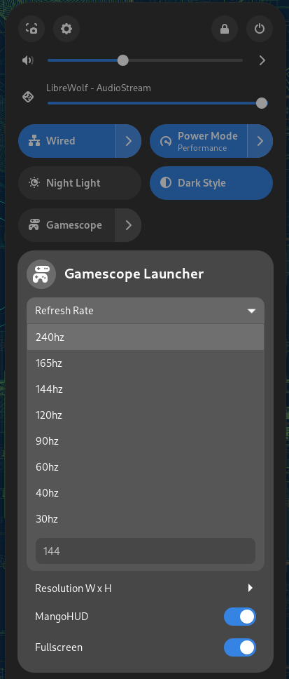

<h2 align="center"><strong>Gamescope Launcher</strong></h2>
<h4 align="center">A <a href="https://www.gnome.org/">GNOME</a> extension to launch and control <a href="https://www.valvesoftware.com/en/">Valve's</a> <a href="https://github.com/ValveSoftware/gamescope">Gamescope compositor</a>.</h4>

### Gamescope Launcher Quick Settings Menu

## Features
- Modify Gamescope launch options including:
  - resolution, with custom (arbitrary) input option.
  - refresh rate, with custom (arbitrary) input option.
  - whether to launch in fullscreen mode.
  - whether to launch the [MangoHUD](https://github.com/flightlessmango/MangoHud) Vulkan/OpenGL overlay.
- Launch and stop Gamescope
- Monitor Gamescope status with panel indicator

## Installation

1. No extension store release yet, so it must be installed manually.
  Use `Git` and clone the repository to this location:
  `~/.local/share/gnome-shell/extensions/gamescope-launcher@danielyrovas.com`

## TODO:
- Extension store release.

## Free Software

The Software is provided “as is”, without warranty of any kind. In no event shall the authors or copyright holders be liable for any claim, damages or other liability in connection with the Software.
